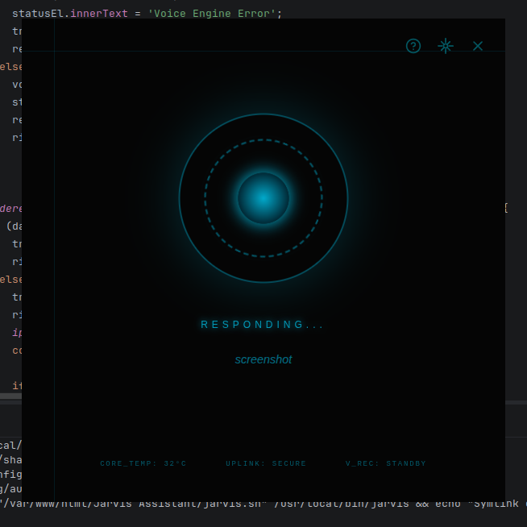

# 🤖 JARVIS Assistant

<p align="center">
  
</p>

<p align="center">
  <strong>Just A Rather Very Intelligent System</strong><br>
  Offline AI Voice Assistant inspired by Iron Man
</p>

<p align="center">
  
  
  
  
</p>

---

## 🚀 Overview

JARVIS is an **offline-capable AI voice assistant** built with Electron and Python.

Control your system, launch apps, play music, and interact using **natural voice commands** — all without relying on cloud services.

---

## ✨ Features

### 🎤 Voice AI
- Offline speech recognition using **Vosk**
- Wake word activation: **"Daddy is Home"**
- **Fuzzy matching** with edit-distance tolerance — no need to speak perfectly
- Word-to-number parsing for spoken numbers (e.g. "volume fifty")
- **Neural TTS** via [Piper](https://github.com/rhasspy/piper) — natural human-sounding British voice
- **Auto mic-mute** during speech — prevents JARVIS from hearing itself
- Fallback to spd-say if Piper unavailable

### 🎨 Interface
- Clean three-panel grid layout with Orbitron + Rajdhani fonts
- Arc Reactor core with multi-ring animations
- Gold accent headers, purple model labels, color-coded alerts
- Subtle scan-line overlay for depth
- Overlay panels for settings and command reference
- Status bar with live indicators

### 📊 Real-Time System Monitoring
- **CPU**: Usage %, temperature, core count, model name
- **Memory**: Usage %, used/total GB
- **Disk**: Usage %, used/total GB
- **Network**: Live download/upload speed
- **GPU**: Temperature, model, VRAM
- **System**: OS, kernel version, uptime
- **Displays**: Multi-monitor detection with resolutions
- **Session**: Live clock and date
- Color-coded alerts (green → yellow → red)

### ⚡ System Control
- Launch & close applications by voice
- Volume control via **PipeWire** (`wpctl`) with `amixer` fallback
- Spoken number support: "set volume to fifty"
- Screenshots & screen lock
- Internet speed test (auto-starts via speedtest.net/run)

### 🖥️ Dual Monitor Support
- Detects and displays all connected monitors
- Voice command: **"Move to other screen"** — toggles JARVIS between displays

### 🎵 Media
- Spotify voice control (search, play, pause, skip)
- Media key simulation (works with any player)

### 💻 Developer Mode
- One command workspace setup:
  > "We have work to do" → Chrome + IntelliJ + Discord + Spotify

---

## 🧠 How It Works

```
Microphone → Vosk (offline) → Command Parser → Electron IPC → Action → TTS Response
```

---

## 🏗️ Architecture

```
┌─────────────────────────────┐
│  UI (Electron Renderer)     │
│  ├─ Left Panel  (sys stats) │
│  ├─ Center      (reactor)   │
│  └─ Right Panel (hw info)   │
├─────────────────────────────┤
│  Main Process (Node.js)     │
│  ├─ systeminformation       │
│  ├─ wpctl / amixer          │
│  └─ xdotool                 │
├─────────────────────────────┤
│  Python Voice Engine        │
│  ├─ Vosk (speech-to-text)   │
│  └─ spd-say (text-to-speech)│
└─────────────────────────────┘
```

---

## 🔌 Integrations

| Package | Purpose |
|---------|---------|
| **Vosk** | Offline speech recognition |
| **Piper** | Neural TTS (natural human voice) |
| **speech-dispatcher** | Fallback TTS (spd-say) |
| **systeminformation** | CPU, RAM, disk, GPU, network stats |
| **xdotool** | System automation & media keys |
| **wpctl / amixer** | Volume control (PipeWire / ALSA) |
| **Spotify** | Music search & playback |
| **Electron** | Desktop UI framework |

---

## 📦 Installation

<details>
<summary><strong>🔧 Requirements</strong></summary>

- Linux (Ubuntu/Fedora/Arch)
- Node.js 18+
- Python 3.8+
- Microphone
- PipeWire or PulseAudio (for volume control)

</details>

---

### 1. Clone

```bash
git clone https://github.com/pateras95/jarvis-assistant.git
cd jarvis-assistant
```

### 2. Install dependencies

```bash
npm install
pip3 install vosk sounddevice piper-tts
```

### 3. Install system tools

```bash
# Ubuntu/Debian
sudo apt install speech-dispatcher xdotool

# Fedora
sudo dnf install speech-dispatcher xdotool

# Arch
sudo pacman -S speech-dispatcher xdotool
```

### 4. Download voice model (for natural TTS)

The Piper neural voice model (~61MB) is included in `tts_models/`. If missing:

```bash
mkdir -p tts_models
wget -O tts_models/voice.onnx "https://huggingface.co/rhasspy/piper-voices/resolve/v1.0.0/en/en_GB/alan/medium/en_GB-alan-medium.onnx"
wget -O tts_models/voice.onnx.json "https://huggingface.co/rhasspy/piper-voices/resolve/v1.0.0/en/en_GB/alan/medium/en_GB-alan-medium.onnx.json"
```

### 5. Run

```bash
npm start
```

---

## 🎤 Voice Commands

| Command | Action |
|---------|--------|
| "Daddy is Home" | Activate JARVIS (wake word) |
| "Gabby is here" | Greet Gabby + play her song 💜 |
| "Open Chrome" | Launch application |
| "Close Spotify" | Kill application |
| "Play [song name]" | Search & play on Spotify |
| "Pause" / "Resume" / "Next" / "Previous" | Media controls |
| "Volume up" / "Volume down" | Adjust volume ±5% |
| "Volume fifty" / "Set volume to 80" | Set exact volume (words or digits) |
| "Mute" | Toggle mute |
| "Search [query]" | Google search |
| "Test internet" / "Speed test" | Open speedtest.net (auto-starts) |
| "Screenshot" | Capture screen |
| "Lock screen" | Lock session |
| "Brightness up" / "Brightness down" | Screen brightness control |
| "Do not disturb" | Disable notifications |
| "Notifications on" | Re-enable notifications |
| "Empty trash" | Clear trash/recycle bin |
| "Restart computer" / "Power off" | System restart/shutdown (5s delay) |
| "Move to other screen" | Toggle window between monitors |
| "What can you do" | List all JARVIS abilities |
| "We have work to do" | Launch full dev workspace |
| "What time" / "What date" | Time & date |
| "Tell me a joke" | Random dev joke |
| "Goodbye" | Shut down JARVIS |

---

## ⚙️ Configuration

| File | What to edit |
|------|-------------|
| `main.js` | App launcher map, system command handlers |
| `renderer.js` | Voice command matching, UI behavior |
| `index.html` | Layout, styling, panel content |

---

## 🛠️ Troubleshooting

<details>
<summary><strong>🔊 Volume not working</strong></summary>

Check which audio system you have:

```bash
# PipeWire (modern)
wpctl get-volume @DEFAULT_AUDIO_SINK@

# PulseAudio (legacy)
pactl get-sink-volume @DEFAULT_SINK@

# ALSA (fallback)
amixer get Master
```

JARVIS uses `wpctl` first, then falls back to `amixer`.

</details>

<details>
<summary><strong>🎤 Voice not working</strong></summary>

```bash
arecord -l                  # Check microphone
ls models/english/          # Verify Vosk model
```

</details>

<details>
<summary><strong>🖥️ Dual monitor not detected</strong></summary>

```bash
xrandr --listmonitors       # Check connected displays
```

JARVIS auto-detects all displays on startup.

</details>

<details>
<summary><strong>🌐 Speed test not auto-starting</strong></summary>

JARVIS opens `speedtest.net/run` which auto-starts the test. If Chrome blocks it, the page will still load for manual start.

</details>

---

## 🏗️ Build

```bash
npm run build:linux
```

---

## 🤝 Contributing

1. Fork the repository
2. Create a feature branch
3. Commit your changes
4. Push to your branch
5. Open a Pull Request

---

## 📜 License

This project is licensed under the **ISC License**.

---

## 💡 Future Ideas

* 🌦️ Weather API integration
* 🏠 Smart home control
* 🌍 Multi-language support
* 🤖 AI conversational mode (LLM integration)
* 📊 Process manager (kill by voice)
* 🔋 Battery monitoring (laptops)

---

## 🔢 Versioning

JARVIS uses **automatic semantic versioning**. A git pre-commit hook bumps the patch version in `package.json` on every commit:

```
2.4.0 → commit → 2.4.1 → commit → 2.4.2 → ...
```

The real version from `package.json` is displayed in the bottom-right of the UI.

---

<p align="center">
  <em>"Sometimes you gotta run before you can walk."</em><br>
  — Tony Stark
</p>
